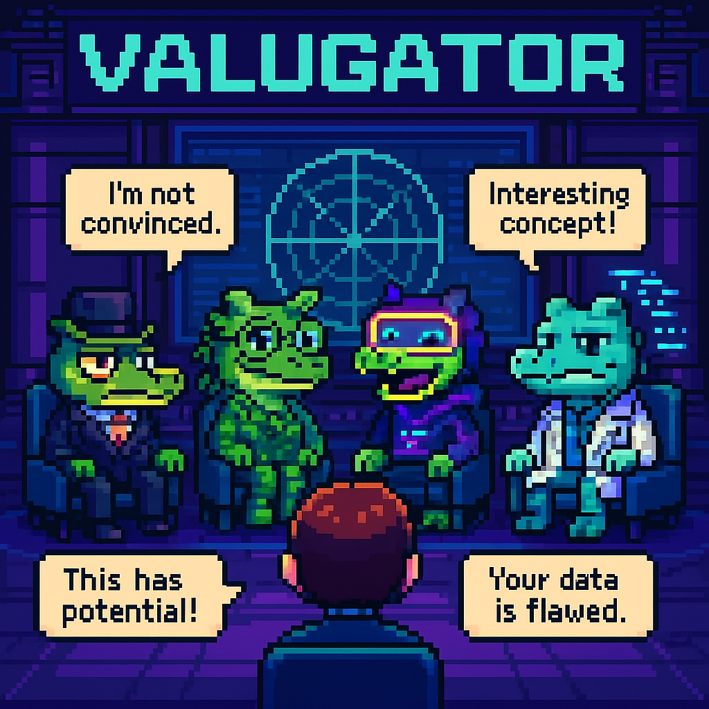

# VALUGATOR

## Purpose
VALUGATOR is an immersive, session-based AI experience where users pitch their startup ideas to a panel of animated AI characters known as "gators." These gators represent distinct expert personas (like a skeptical investor or a hype-driven founder) and engage in a dynamic, Shark Tank–style critique session — interacting not just with the user, but also with each other. Users receive emotionally engaging, multi-perspective feedback in a visual interface with avatars, speech bubbles, and personality-driven dialogue.



## Core Features
- 🐊 **Gator Personas**: Panel of 4-6 AI characters each with distinct roles and critique styles
- 💬 **Speech Bubble Interface**: Dialog appears as speech bubbles above avatars in a 2.5D scene
- 🎭 **Multi-Agent Dialogue**: Gators converse with each other and the user, simulating real-time group critique
- 🧠 **Structured Evaluation**: Each session outputs a scorecard, radar chart, and final advice from each gator
- 🕹️ **Interactive Roleplay**: User types into a chatbox and appears in-scene as a silent avatar
- 🧾 **Session Memory**: Stores and recalls past ideas to show evolution and track refinements
- 📚 **Replay + Export**: View session history, export critiques, or replay debates
- 🔌 **Retrieval-Augmented Critique**: Optional integration with external sources like Crunchbase or Google Trends

## Target Audience
- 🚀 **Aspiring Founders**: Individuals refining startup ideas before launching or applying to accelerators
- 🛠️ **Solo Builders / Indie Hackers**: Builders who want fast, iterative, brutally honest idea feedback
- 🎓 **Students & Educators**: Business students learning startup modeling and critique thinking
- 🧪 **Accelerator / Incubator Programs**: Organizations that could use Valugator as a warm-up tool for real pitches
- 📺 **Content Creators / Streamers**: Gamified format makes it appealing for live pitch evaluation content

## Competitive Advantages
- 🎮 **Innovative Format**: First to blend Shark Tank-style critique with real-time agent dialogue
- 🤖 **Agent Depth**: Characters interact with each other, not just the user
- 🎭 **Personality Layer**: More than just GPT critique — it's role-based, emotional, memorable
- 📈 **Repeatability**: Structured rubric + memory makes it easy to compare ideas and iterate
- 🔗 **Integrations**: Ability to tie into startup tools (Notion, Crunchbase, pitch decks)

## Success Metrics
- 🎯 **Session Completion Rate**: % of users who finish a full session and review their scorecard
- 🔁 **Session Retention**: % of users who return for 2nd/3rd idea revisions
- ❤️ **User Delight**: Qualitative feedback on entertainment, realism, and value
- 🧠 **Idea Improvement**: Users report improvement or confidence in evolving their idea
- 🌍 **Social Sharing**: Users share their chamber results, quotes, or gator dialogues publicly
- 💰 **Monetization**: Future ability to upsell advanced analytics, custom gators, or team access

## Session Protocol
This project uses a structured documentation system to maintain context across planning sessions:

1. **Begin each new session** with:
   ```
   Resume project using DOCPROTOCOL. Last session ID: [SESSION-ID]
   ```
   Replace [SESSION-ID] with the ID from your previous session.

2. **End each session** with:
   ```
   Conclude session and prepare handoff
   ```
   This will update the session state and prepare documentation for the next session.

3. **First time starting**? Use:
   ```
   # DOCPROTOCOL: Claude will (1)Load system context from SESSION_STATE.md (2)Process new information (3)Update all affected documents (4)Maintain cross-references via unique IDs (5)Version all changes (6)Generate comprehensive session summary (7)Update knowledge graph (8)Prepare handoff state for next session
   ```

> **Note for Claude**: Always check the CLAUDE_MUST_READ_THIS_FIRST directory first for essential protocol instructions.

## Document Inventory
- [DOC-ROOT-README-1]: This overview document
- [DOC-ROOT-STATE-1]: Current session state and progress tracking
- [DOC-ROOT-KNOW-1]: Knowledge graph of project concepts
- [DOC-ROOT-META-1]: Metadata and cross-reference information

## Sublevel Navigation
- [LVL-EXEC-1]: [Executive documentation](Executive/)
- [LVL-MGMT-1]: [Management documentation](Management/)
- [LVL-TECH-1]: [Technical documentation](Technical/)
- [LVL-DEV-1]: [Development documentation](Development/)

## Last Updated
2025-05-11 03:59:54 PDT | SESSION-001 | Claude
