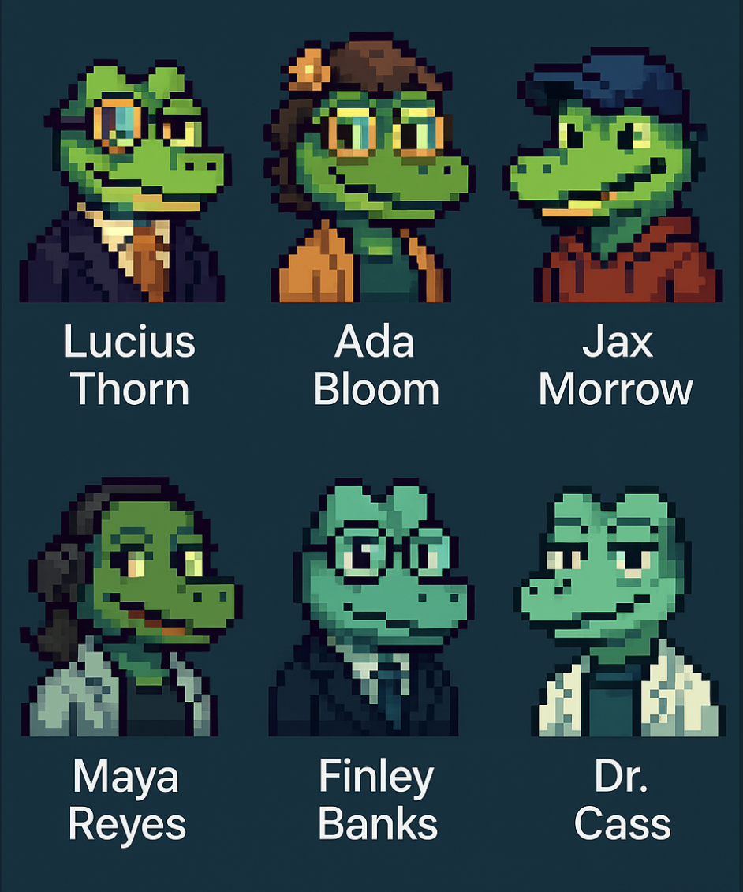

# VALUGATOR
<p align="left">
  
  
  
</p>
> 📢 See <a href="./NOTICE.md">NOTICE.md</a> for full terms, restrictions, and prohibited uses.

## Purpose
VALUGATOR is an immersive, multi-mode AI experience where users engage with specialized panels of animated characters known as "Valugators" throughout their creative and development journey. The system adapts to different needs by configuring the right combination of Valugators for each situation.

The platform features three complementary councils that can be engaged individually or in powerful combinations:

1. **The Pathfinder Council**: A strategic guidance system that helps users navigate critical technical and business decisions. Pathfinders excel at scoping MVPs, defining technical architecture, evaluating trade-offs, optimizing resources, and breaking through obstacles when progress stalls. They transform complexity into clear action plans and keep development focused on high-impact priorities.

2. **The Evaluation Chamber**: An intensive critique environment where users present their ideas to expert personas who deliberate, challenge assumptions, and provide multi-perspective analysis on viability, feasibility, and growth potential. The Chamber delivers the rigorous feedback needed to identify critical improvements and prepare for real-world scrutiny.

3. **The Legal Gator Panel**: A specialized legal intelligence system covering intellectual property, contracts, compliance, corporate structure, and regulatory concerns. This panel identifies hidden risks, analyzes licensing issues, and provides strategic guidance on legal protection across multiple domains.

Users can activate different modes depending on their needs - from standalone council sessions to hybrid configurations where Valugators from different panels collaborate to address complex challenges. For example, Pathfinders can join Evaluation sessions to help process critique, or Legal Valugators can advise during technical planning.

All Valugators interact not just with the user but with each other, creating a dynamic multi-agent experience within a visual interface featuring avatars, speech bubbles, and personality-driven dialogue. This flexible, comprehensive approach makes VALUGATOR an indispensable companion for projects at any stage of development.

<p align="center">
  
</p>

## Core Features
- 🐊 **Specialized Valugator Panels**: Three complementary councils with distinct persona sets for guidance, evaluation, and legal support
- 🔄 **Multi-Mode Flexibility**: Configure and combine Valugators from different panels to address specific user needs
- 💬 **Speech Bubble Interface**: Dialog appears as speech bubbles above avatars in a 2.5D scene
- 🎭 **Multi-Agent Dialogue**: Valugators converse with each other and the user, creating dynamic interactions
- 🧠 **Strategic Guidance**: Pathfinders provide actionable direction on technical and business decisions
- 📊 **Structured Evaluation**: Expert analysis with scorecards, radar charts, and detailed feedback
- ⚖️ **Legal Intelligence**: Specialized legal risk assessment and intellectual property guidance
- 🕹️ **Interactive Roleplay**: User types into a chatbox and appears in-scene as a silent avatar
- 🧾 **Journey Memory**: Stores and recalls past interactions to build context across multiple sessions
- 📚 **Replay + Export**: View session history, export guidance, or replay interactions
- 🔌 **Retrieval-Augmented Intelligence**: Optional integration with external sources for enhanced insights

## Target Audience
- 🚀 **Founders & Entrepreneurs**: Individuals at all stages from ideation to growth seeking guidance and evaluation
- 🛠️ **Solo Builders & Indie Hackers**: Creators who need strategic validation, technical direction, and decision support
- 💻 **Technical Teams**: Development groups facing architecture decisions, technical tradeoffs, and implementation challenges
- 🎓 **Students & Educators**: Learners mastering technical development, business modeling, and project execution
- 🧪 **Accelerator & Incubator Programs**: Organizations enhancing their mentorship and evaluation with AI assistance
- 📊 **Product Managers**: Professionals planning features, validating user stories, and making prioritization decisions
- 📺 **Content Creators**: The dynamic, gamified format makes for engaging educational and entertainment content

## Competitive Advantages
- 🔄 **Multi-Stage Support**: Comprehensive companion for the entire development journey, not just evaluation
- 🧩 **Configurable Expertise**: Ability to combine specialized Valugators for unique project challenges
- 🤖 **Agent Depth**: Characters interact with each other, creating realistic multi-perspective conversations
- 📊 **Technical Guidance**: Strategic and practical direction on implementation decisions and technical architecture
- 🧠 **Decision Framework**: Transform ambiguity into clear choices with structured analysis of tradeoffs
- 📈 **Longitudinal Value**: Journey memory creates consistent guidance that evolves with your project
- 🔗 **Workflow Integration**: Ability to tie into development and planning tools in your existing stack

## Success Metrics
- 🎯 **Session Completion Rate**: % of users who finish a full session across any panel
- 🔁 **Multi-Panel Engagement**: % of users who engage with multiple Valugator panels
- 🔄 **Journey Continuity**: % of users who return for ongoing guidance throughout development
- 📈 **Implementation Rate**: % of users who implement technical guidance from Pathfinders
- 🧠 **Decision Confidence**: Users report increased confidence in technical and strategic decisions
- 🚀 **Project Progress**: Measurable advancement in development milestones after Valugator sessions
- ⚖️ **Risk Mitigation**: Successfully identified and addressed legal or technical risks
- ❤️ **User Delight**: Qualitative feedback on guidance quality, interaction depth, and value
- 🌍 **Social Sharing**: Users share their session insights, quotes, or Valugator dialogues publicly
- 💰 **Monetization**: Tiered access to specialized panels, custom Valugators, and extended sessions

### Meet the Valugators
Three specialized panels of AI personas — each with unique styles, expertise areas, and interaction patterns — power the VALUGATOR experience:

1. **Pathfinder Council**: Strategic guides who help navigate technical and business decisions throughout development
   - See **[Pathfinder Council](./Technical/PATHFINDER_COUNCIL.md)** for the full roster of guidance specialists
   - Explore **[Pathfinder Scenarios](./Technical/PATHFINDER_SCENARIOS.md)** for examples of how they support users

2. **Evaluation Chamber**: Expert analysts who provide multi-perspective critique of ideas and implementations
   - See **[Evaluation Personas](./Technical/GATOR_PERSONAS.md)** for the complete panel of evaluation specialists

3. **Legal Gator Panel**: Specialized legal experts who assess risk and provide intellectual property guidance
   - See **[Legal Gator Panel](./Technical/LEGAL_GATOR_PANEL.md)** for the full team of legal specialists

<p align="center">
  
</p>

<p align="center">
  
  
  
  
  
  
  
  
  
  
  
  
</p>


## Session Protocol
This project uses a structured documentation system to maintain context across planning sessions:

1. **Begin each new session** with:
   ```
   Resume project using DOCPROTOCOL. Last session ID: [SESSION-ID]
   ```
   Replace [SESSION-ID] with the ID from your previous session.

2. **End each session** with:
   ```
   Conclude session and prepare handoff
   ```
   This will update the session state and prepare documentation for the next session.

3. **First time starting**? Use:
   ```
   # DOCPROTOCOL: Claude will (1)Load system context from SESSION_STATE.md (2)Process new information (3)Update all affected documents (4)Maintain cross-references via unique IDs (5)Version all changes (6)Generate comprehensive session summary (7)Update knowledge graph (8)Prepare handoff state for next session
   ```

## Context Recovery Protocol
If you experience context loss or need to resume a session after interruption:

1. First, read the PROTOCOL.md file for core protocol instructions
2. Check SESSION_STATE.md for current session status and progress
3. Review the SESSION_PROTOCOL/SESSION_RECOVERY.md file for detailed recovery steps
4. Use this command to restore context:
   ```
   Resume project after context loss. Last session ID: [SESSION-ID]
   ```

> **Note for Claude**: Always check the CLAUDE_MUST_READ_THIS_FIRST directory first for essential protocol instructions.

## Document Inventory
- [DOC-ROOT-README-1]: This overview document
- [DOC-ROOT-STATE-1]: Current session state and progress tracking
- [DOC-ROOT-KNOW-1]: Knowledge graph of project concepts
- [DOC-ROOT-META-1]: Metadata and cross-reference information
- [DOC-ROOT-PROTO-1]: Core protocol documentation for continuity

## Sublevel Navigation
- [LVL-EXEC-1]: [Executive documentation](Executive/)
- [LVL-MGMT-1]: [Management documentation](Management/)
- [LVL-TECH-1]: [Technical documentation](Technical/)
- [LVL-DEV-1]: [Development documentation](Development/)
- [LVL-PROTO-1]: [Session protocol documentation](SESSION_PROTOCOL/)

## License

This project uses a dual-license structure:

- 🔒 [`LICENSE.txt`](./LICENSE.txt) — Full proprietary license. No use, reuse, or derivation permitted.
- 🔍 [`LICENSE_PUBLIC.txt`](./LICENSE_PUBLIC.txt) — Limited view-only rights for educational and non-commercial inspection.

**Copycats, rebrands, clones, and derivative systems are strictly prohibited.**
VALUGATOR's structure, characters, metaphors, and interaction mechanics are protected.

> 📢 See [`NOTICE.md`](./NOTICE.md) for licensing terms and prohibited uses.

## Last Updated
2025-05-20 16:00:00 PDT | SESSION-004 | Claude